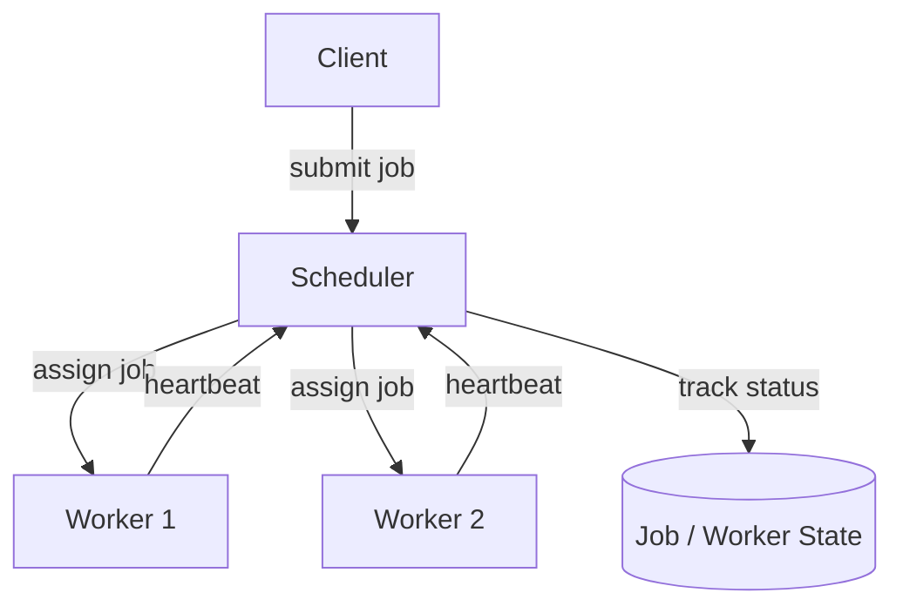

# Architecture

## Goal:

Build a distributed GPU scheduler which assigns jobs to worker nodes based on
available resources.

## Components:

### Scheduler:

Responsibilities:

- Recieve jobs
- Track workers
- Allocate resources
- Assign jobs
- Detect worker failures

### Worker:

Responsibilities:

- Register with scheduler
- Excecute jobs
- Report status
- Send hearbeats

### Client:

Responsibilities:

- Submit jobs
- Query status

## Resources:

Each worker reports:

- CPU core
- Memory
- GPU's

## Job lifecycle:

- Submission
- Scheduling
- Execution
- Completion

## Future features:

- Priority scheduling
- Fair scheduling
- GPU topology awareness
- NUMA awareness

### Future serialization methods:
- Protocol Buffers (Google Protobuf)
- FlatBuffers
- Cap'n Proto

## Architecture Diagram

## Job States

# Job State Definitions

A Job moves through a lifecycle controlled by the Scheduler. 
Phase 1 only requires: `Submitted → Queued → Running → Completed`.

| State | Meaning |
|---|---|
| **Submitted** | Job has been created by the client and received by the scheduler. |
| **Queued** | Job is waiting in the scheduler queue for available resources. |
| **Scheduling** | Scheduler is searching for a suitable worker. |
| **Assigned** | Scheduler has selected a worker for the job. |
| **Dispatching** | Job information is being sent to the selected worker. |
| **Running** | Worker has accepted the job and execution is in progress. |
| **Retrying** | Job failed temporarily and is being rescheduled. |
| **Failed** | Job cannot complete successfully after failure handling. |
| **Completed** | Job finished execution successfully. |