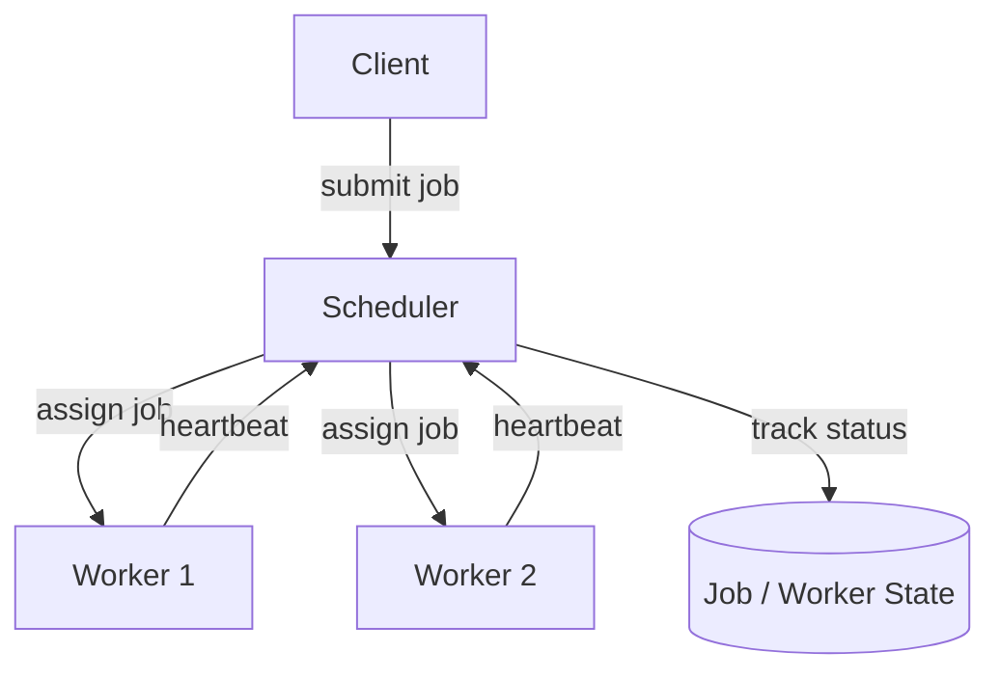

# Architecture

## Goal:

Build a distributed GPU scheduler which assigns jobs to worker nodes based on
available resources.

## Components:

### Scheduler:

Responsibilities:

- Recieve jobs
- Track workers
- Allocate resources
- Assign jobs
- Detect worker failures

### Worker:

Responsibilities:

- Register with scheduler
- Excecute jobs
- Report status
- Send hearbeats

### Client:

Responsibilities:

- Submit jobs
- Query status

## Resources:

Each worker reports:

- CPU core
- Memory
- GPU's

## Job lifecycle:

- Submission
- Scheduling
- Execution
- Completion

## Future features:

- Priority scheduling
- Fair scheduling
- GPU topology awareness
- NUMA awareness

### Future serialization methods:
- Protocol Buffers (Google Protobuf)
- FlatBuffers
- Cap'n Proto

## Architecture Diagram

